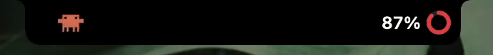
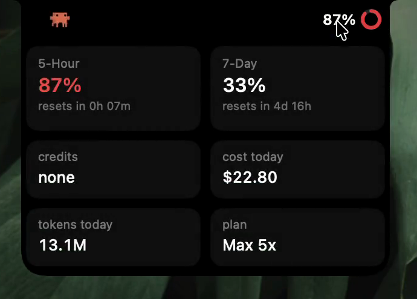

<div align="center">

# 🦀 Claude Notch Usage Companion

**A Dynamic Island for your Mac's notch — live Claude usage, with Clawd the crab.**


<sub><a href="docs/demo.mp4">watch the full demo ↗</a></sub>

<br/>

[](https://github.com/stevemcqueenz/claude-notch-tracker/releases/latest)
&nbsp;
&nbsp;[](LICENSE)

<br/><br/>

<a href="https://www.producthunt.com/products/mac-claude-notch-usage-tracker?embed=true&utm_source=badge-featured&utm_medium=badge&utm_campaign=badge-mac-claude-notch-usage-companion" target="_blank" rel="noopener noreferrer"></a>

</div>

The same **5-hour**, **7-day**, and **credit** numbers you see in Claude Desktop — live in
the notch. Collapsed, it's just Clawd + your session % beside the camera; click it and the
island glides open into a tile grid, click away and it glides shut.

## Screenshots

<div align="center">
  <br/>
  <sub><b>Collapsed</b> — Clawd + your live session %</sub>
  <br/><br/>
  <br/>
  <sub><b>Expanded</b> — the full breakdown</sub>
</div>

## Features

- **Live usage** — 5-hour session, 7-day weekly, and extra credits, each with a reset
  countdown. Matches Claude Desktop exactly.
- **Any Claude login works** — Claude Desktop, a browser signed into claude.ai, or the
  **Claude Code CLI** (even terminal-only, with no desktop app or browser installed).
- **At-a-glance** session % + colour ring (white → amber → red) in the notch.
- **Tile grid** on click: 5-Hour, 7-Day, credits, cost today, tokens today, and your
  plan (e.g. Claude Max 5x).
- **Cost + tokens today** computed locally from your `~/.claude` logs, kept live.
- **Clawd**, the walking crab — he quickens as you near your limit and freezes when
  you're out. Prefer a mono crab or the Claude Spark? Click to swap.
- **No menu-bar clutter** — everything's on a right-click; the island is the whole UI.
- **Smooth morph** animation (a real notch-shaped window, not a resizing rectangle).
- Draws its **own notch** on non-notch Macs.

## How it works

Claude Notch reads *your own* local Claude session — from **Claude Desktop**, a
**browser signed into claude.ai** (Chrome, Brave, Edge, Arc, Firefox, Zen), or the
**Claude Code CLI** — and calls the same usage endpoint the official apps use. Nothing
leaves your machine; it talks only to Anthropic, with your own session. No analytics, no
third-party servers.

For Desktop and browsers, the session cookie is read from the local cookie store
(Chromium's is decrypted with the OS Keychain "Safe Storage" key, the same mechanism the
browsers use). For the terminal, it reuses the Claude Code CLI's own login token from the
Keychain — **read-only, and never refreshed, so your CLI session is left untouched**.
Either way, macOS asks your permission via a Keychain prompt on first run.

## Requirements

- macOS 14+ (Apple Silicon or Intel)
- A signed-in Claude session — **Claude Desktop**, a supported **browser** on claude.ai,
  or the **Claude Code CLI** (works even with no desktop app or browser)

## Install

**Download:** grab the latest `Claude Notch.zip` from
[Releases](../../releases) → unzip → drag `Claude Notch.app` to Applications →
**double-click** to open (it's signed + **notarized**, so no security warning). On
first run, **Always Allow** the Keychain prompt so it can read your local Claude
session. Right-click the island → *Launch at Login* to keep it around.

**Build from source:**

```bash
git clone <this-repo>
cd "claude notch"
swift run ClaudeNotch        # dev run
bash scripts/make-app.sh     # builds dist/Claude Notch.app + a shareable zip
```

Requires a full Xcode toolchain (the Swift Testing / SwiftUI macros need it) —
`export DEVELOPER_DIR=/Applications/Xcode.app/Contents/Developer` if `swift` points at
the Command Line Tools.

## Usage

- **Click** the % / ring → expand; **click away** → collapse.
- **Click Clawd** → cycle icon (Clawd → mono → Spark).
- **Right-click** the island → Icon, Pause, Animate icon, Launch at Login,
  Check for Updates, Quit.

## Credits

- Clawd crab + Spark animation frames © **Mick Cesanek**
  ([claude-status-bar](https://github.com/m1ckc3s/claude-status-bar), MIT).
- Notch-shape and Dynamic-Island approach inspired by
  [pookify](https://github.com/eyadhammouda/pookify) (MIT).
- "Claude" and the spark are trademarks of Anthropic, PBC, used nominatively.

## License

MIT — see [LICENSE](LICENSE). Built with [Claude Code](https://claude.com/claude-code).
