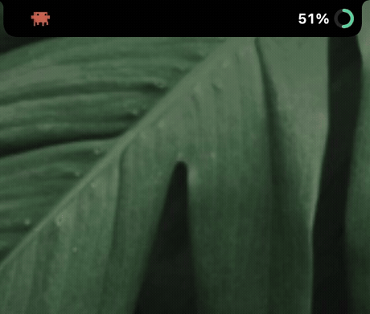
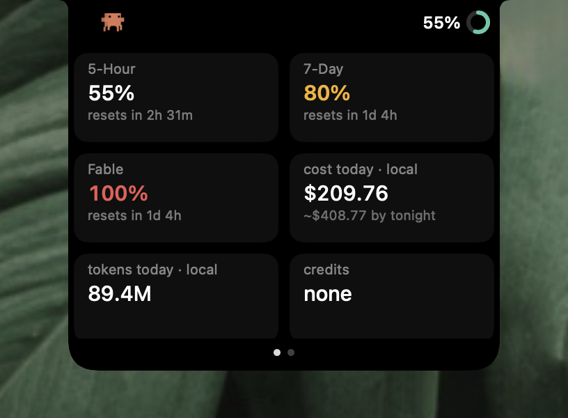
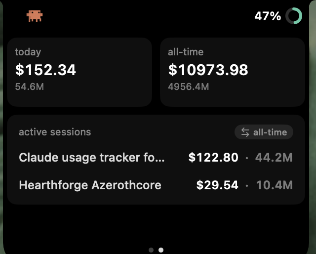
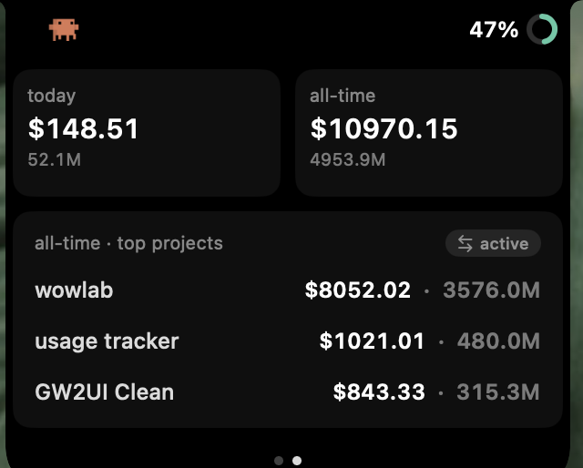
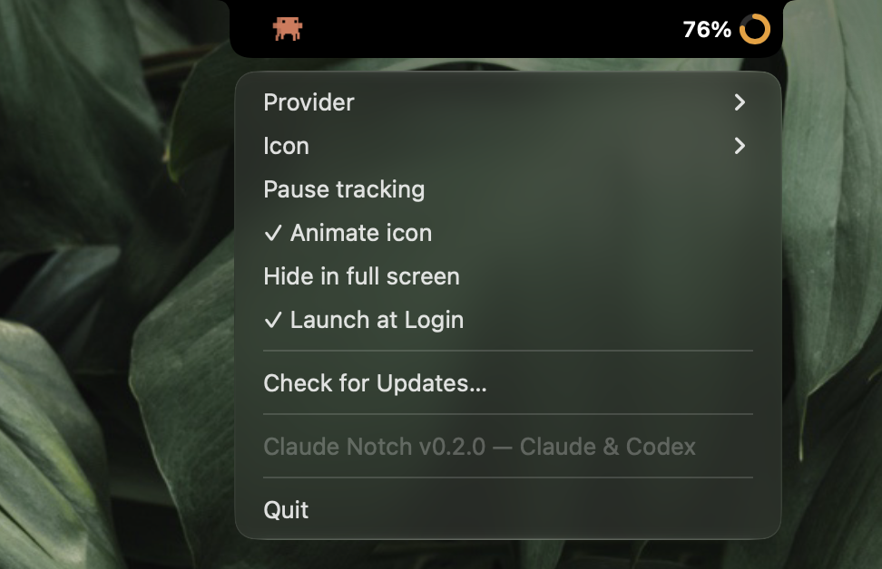
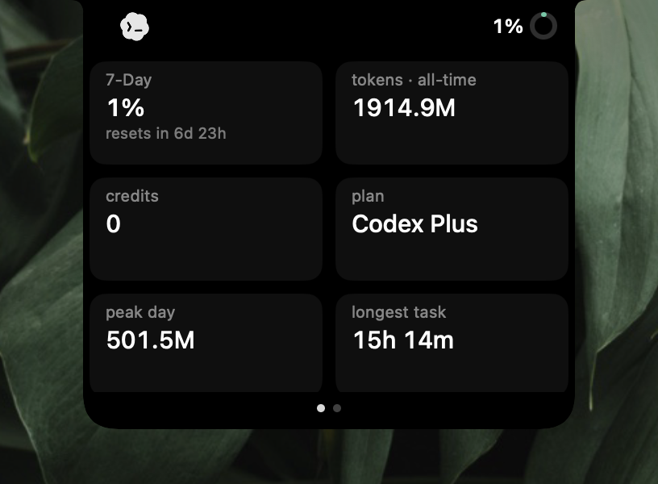
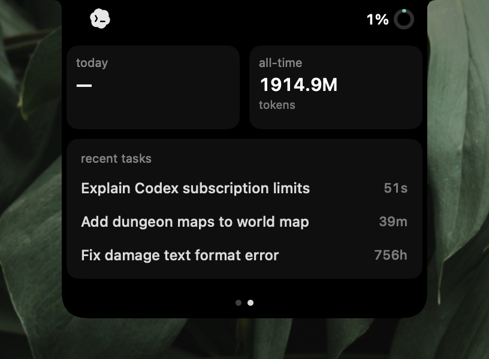
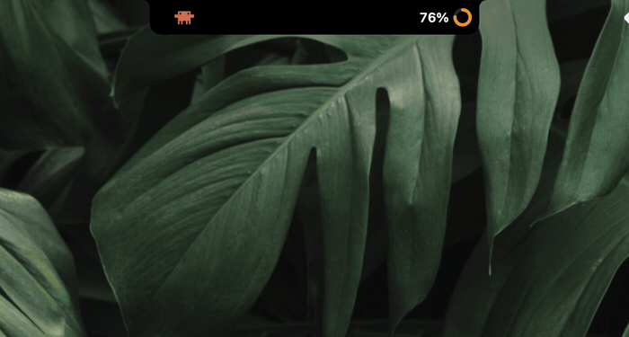

<div align="center">

# 🦀 Claude & Codex Notch Usage Companion

**Live Claude and Codex usage in your Mac's notch: limits, resets, tokens, and cost.**



[](https://github.com/stevemcqueenz/claude-notch-tracker/releases/latest)
&nbsp;
&nbsp;[](LICENSE)

<br/>

<a href="https://www.producthunt.com/products/mac-claude-notch-usage-tracker?embed=true&utm_source=badge-featured&utm_medium=badge&utm_campaign=badge-mac-claude-notch-usage-companion" target="_blank" rel="noopener noreferrer"></a>

</div>

Collapsed, it's just **Clawd** (the crab) and your session % beside the camera. Click it and the
island glides open into a two-page card you can **swipe** through. Your real limits sit up front;
your spend and sessions sit behind. Click away and it glides shut. No Dock icon, no menu-bar clutter.

## Screenshots

<table align="center">
<tr>
<td align="center" width="50%">
  <br/>
  <sub><b>Limits</b>: 5-hour, 7-day, Fable weekly, plus today's cost</sub>
</td>
<td align="center" width="50%">
  <br/>
  <sub><b>Active sessions</b>: today's spend, per conversation</sub>
</td>
</tr>
<tr>
<td align="center" width="50%">
  <br/>
  <sub><b>All-time top projects</b>: tap the ⇄ chip to switch</sub>
</td>
<td align="center" width="50%">
  <br/>
  <sub><b>Settings</b>: right-click the island</sub>
</td>
</tr>
<tr>
<td align="center" width="50%">
  <br/>
  <sub><b>Codex limits</b>: windows, credits, plan + lifetime stats</sub>
</td>
<td align="center" width="50%">
  <br/>
  <sub><b>Codex tasks</b>: account totals + recent tasks</sub>
</td>
</tr>
</table>

<div align="center">
  <br/>
  <sub><b>One click switches providers</b>: Claude ⇄ Codex, even while expanded</sub>
</div>

## Features

- **Real limit tiles.** Your **5-hour** session, **7-day** weekly, *and* **Fable's own weekly
  limit**. Fable is metered separately, so you get the same three bars the Claude desktop app
  shows, each with a reset countdown and colour-coded urgency.
- **Claude and Codex providers.** Click the left icon to switch providers. Codex limits, credits,
  plan, token totals, lifetime stats, and recent tasks come from the official local
  `codex app-server` interface.
- **Two pages, one swipe.** Limits up front. Swipe (or tap the dots) to a local detail page with
  today versus all-time spend, plus your live sessions.
- **Named sessions.** Your actual **conversation titles** from the sidebar, with today's spend per
  conversation. Tap the block to flip to your **all-time biggest projects**.
- **Cost, live.** Cost and tokens today, an **"~$X by tonight"** projection, and all-time totals
  from a full-history scan of your logs.
- **Any Claude login works.** Use **Claude Desktop**, a **browser** signed into claude.ai, or the
  **Claude Code CLI** (terminal only, with no desktop app or browser needed).
- **Hide in full screen.** An opt-in toggle tucks the island up into the notch while a full-screen
  app owns the display, so movies and video stay uninterrupted, then slides it back on exit.
- **Clawd, the walking crab.** He quickens as you approach a limit and freezes when you're out.
  Prefer a mono crab or the Claude Spark? Pick your look from the right-click Icon menu. On Codex,
  the Codex mark floats in his place.
- **Local-first and private.** Claude Notch reads local provider state and talks only to the
  corresponding first-party service. Local cost and token figures are clearly labelled `local`.
- **Zero fuss.** It draws its own notch on non-notch Macs, auto-updates itself, and lives entirely
  on a right-click menu.

## How it works

Claude Notch reads *your own* local Claude session from **Claude Desktop**, a **browser signed into
claude.ai** (Chrome, Brave, Edge, Arc, Firefox, Zen), or the **Claude Code CLI**. It calls the same
usage endpoint the official apps use, and shows the exact limit bars the desktop app does,
**including Fable's separate weekly limit**.

For Desktop and browsers, the session cookie is read from the local cookie store (Chromium's is
decrypted with the OS Keychain "Safe Storage" key, the same mechanism the browsers use). For the
terminal, it reuses the Claude Code CLI's own login token from the Keychain. That read is
**read-only and never refreshed, so your CLI session is left untouched**. macOS asks your
permission via a Keychain prompt on first run.

> **Limits vs. local.** The 5-hour, 7-day, and Fable tiles come from Anthropic and cover **all**
> your usage, including cloud and remote sessions. The `cost today` and `tokens today` figures are
> computed from your **local** `~/.claude` logs, so they're labelled `local`. Cloud work counts
> toward the limit bars but not toward the local dollar figure.

For Codex, Claude Notch starts the installed official `codex app-server` with fixed JSON-RPC
requests. It does not parse private Codex session logs or estimate dollar costs. Raw prompt previews
and account email addresses are not displayed or retained. See
[Provider Architecture](docs/providers.md) for data sources and security boundaries.

## Requirements

- macOS 14+ (Apple Silicon or Intel)
- A signed-in Claude session, an authenticated Codex installation, or both

## Install

**Download:** grab the latest `Claude Notch.zip` from [Releases](../../releases), unzip it, drag
`Claude Notch.app` to Applications, then **double-click** to open. It's signed and **notarized**, so
there's no security warning. On first run, **Always Allow** the Keychain prompt so it can read your
local Claude session. To keep it around, right-click the island and choose *Launch at Login*.

**Build from source:**

```bash
git clone https://github.com/stevemcqueenz/claude-notch-tracker
cd claude-notch-tracker
swift run ClaudeNotch        # dev run
bash scripts/make-app.sh     # builds dist/Claude Notch.app + a shareable zip
```

Requires a full Xcode toolchain (the SwiftUI macros need it). Run
`export DEVELOPER_DIR=/Applications/Xcode.app/Contents/Developer` if `swift` points at the
Command Line Tools.

## Usage

- **Click** the % or ring to expand, and **click away** to collapse.
- **Swipe** left or right (or tap the dots) to switch between the limits page and the detail page.
- **Tap the sessions block** to flip between today's active sessions and all-time top projects.
- **Click the left icon** to switch between Claude and Codex.
- **Right-click** the island for Provider, Icon (Clawd, mono, Spark), Pause, Animate icon, Hide in
  full screen, Launch at Login, Check for Updates, and Quit.

## Credits

- Clawd crab and Spark animation frames © **Mick Cesanek**
  ([claude-status-bar](https://github.com/m1ckc3s/claude-status-bar), MIT).
- Notch shape and Dynamic Island approach inspired by
  [pookify](https://github.com/eyadhammouda/pookify) (MIT).
- "Claude" and the spark are trademarks of Anthropic, PBC, used nominatively.
- "Codex" and the Codex logo are trademarks of OpenAI, used nominatively.

## License

MIT. See [LICENSE](LICENSE). Built with [Claude Code](https://claude.com/claude-code).
