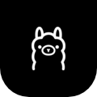

<div align="center">


# Claude Notch

**AI usage limits in your Mac's notch, for Claude, Codex, Antigravity, DeepSeek, opencode-go and Ollama Cloud.**<br/>
Limits, resets, tokens and cost, one click away.

<br/>

[](https://github.com/stevemcqueenz/claude-notch-tracker/releases/latest)
&nbsp;
[](https://stevemcqueenz.github.io/claude-notch-tracker/#film)
&nbsp;
[](https://stevemcqueenz.github.io/claude-notch-tracker/)


[](LICENSE)

<br/>

<a href="https://stevemcqueenz.github.io/claude-notch-tracker/#film"></a>

</div>

Collapsed, it's just **Clawd** (the crab) and your session % beside the camera. Click it and the
island glides open into a two-page card you can **swipe** through: your real limits up front, your
spend and sessions behind. Click away and it glides shut. No Dock icon, no menu-bar clutter.

## Install

1. **Download** `Claude Notch.zip` from the [latest release](https://github.com/stevemcqueenz/claude-notch-tracker/releases/latest), unzip it and drag `Claude Notch.app` to Applications.
2. **Open it.** It's signed and notarized, so there's no security warning. When the Keychain prompt appears, choose **Always Allow** so it can read your local Claude session.
3. **Keep it around.** Right-click the island and choose *Launch at Login*.

You need macOS 14 or later (Apple Silicon or Intel) and at least one of: a signed-in Claude session,
an authenticated Codex installation, an Antigravity CLI (`agy`) login, a DeepSeek API key, an
opencode-go account, or an Ollama API key.

<details>
<summary><b>Build from source</b></summary>
<br/>

```bash
git clone https://github.com/stevemcqueenz/claude-notch-tracker
cd claude-notch-tracker
swift run ClaudeNotch        # dev run
bash scripts/make-app.sh     # builds dist/Claude Notch.app + a shareable zip
```

Requires a full Xcode toolchain (the SwiftUI macros need it). Run
`export DEVELOPER_DIR=/Applications/Xcode.app/Contents/Developer` if `swift` points at the
Command Line Tools.

</details>

## Every page of the island

<table>
<tr>
<td width="50%"></td>
<td width="50%"></td>
</tr>
<tr>
<td><b>Claude limits.</b> 5-hour, 7-day and Fable weekly bars, plus today's cost.</td>
<td><b>Week and sessions.</b> 7 days of spend, then today's conversations by name.</td>
</tr>
<tr>
<td width="50%"></td>
<td width="50%"></td>
</tr>
<tr>
<td><b>Codex.</b> Rate-limit windows, account tokens, credits and plan.</td>
<td><b>Antigravity.</b> Quota windows, plus today's and all-time tokens.</td>
</tr>
<tr>
<td width="50%"></td>
<td width="50%"></td>
</tr>
<tr>
<td><b>DeepSeek.</b> Balance, and whether you're paying peak or off-peak rates right now.</td>
<td><b>opencode-go.</b> 5-hour, weekly and monthly meters, Zen balance and renewal.</td>
</tr>
</table>

<div align="center">
  <br/>
  <sub>One click on the left icon cycles through your providers, even while the island is open.</sub>
</div>

## Providers

Only providers installed on your Mac appear. Click the left icon to cycle through them, or let the
island rotate on its own every 10 s, 30 s or minute (it holds still while the card is open).

| | Provider | What you see | Where it comes from |
|:-:|---|---|---|
|  | **Claude** | 5-hour, 7-day and Fable weekly limits, credits, today's cost with a projection for tonight, named sessions, all-time projects | Claude Desktop, a browser signed in to claude.ai, or the Claude Code CLI login. Cost and tokens from your local `~/.claude` logs |
|  | **Codex** | Rate-limit windows, token totals, credits, plan, recent tasks, 7-day token chart | The official local `codex app-server` interface |
|  | **Antigravity** | Quota windows, tokens, models, projects, week chart | The `agy` CLI's read-only `/usage` command (spends no quota), plus its local conversation stores |
|  | **DeepSeek** | Balance, peak or off-peak pricing right now, spend today and this week | Your DeepSeek API key. Spend is observed from the balance going down, and labelled so |
|  | **opencode-go** | 5-hour, weekly and monthly meters, renewals, Zen balance, sessions | Your opencode.ai browser session, with local history as the fallback |
|  | **Ollama Cloud** | 5-hour and 7-day meters (or the 4-week spend on a credit plan), requests per model this week | Your Ollama API key |

## Features

- **Real limit tiles.** Your 5-hour session, 7-day weekly *and* Fable's own weekly limit, the same
  three bars the Claude desktop app shows, each with a reset countdown and colour-coded urgency.
- **Two pages, one swipe.** Limits up front. Swipe (or tap the dots) to a local detail page with
  today versus all-time spend, plus your live sessions.
- **Named sessions.** Your actual conversation titles from the sidebar, with today's spend per
  conversation. Tap the block to flip to your all-time biggest projects.
- **Cost, live.** Cost today with an *"~$X by tonight"* projection, your usage-credit balance, and
  all-time totals from a full-history scan of your logs.
- **A week at a glance.** Claude, Codex and Antigravity chart the last 7 days right in the island, with today
  highlighted and the peak day labelled.
- **DeepSeek, priced by the hour.** A dot shows the billing phase: green off-peak, amber at peak
  (09:00–12:00 and 14:00–18:00 Beijing time on working days, when DeepSeek bills double). Chinese
  public holidays count as off-peak, as DeepSeek's pricing says.
- **Clawd, the walking crab.** He quickens as you approach a limit and freezes when you're out.
  Prefer a mono crab or the Claude Spark? Pick your look from the right-click Icon menu.
- **Hide in full screen.** An opt-in toggle tucks the island into the notch while a full-screen
  app owns the display, then slides it back on exit.
- **Zero fuss.** It draws its own notch on non-notch Macs, updates itself, and lives entirely on a
  right-click menu.

## Using it

| Do this | To |
|---|---|
| **Click** the % or ring | Open the island. Click anywhere else to close it |
| **Swipe** left or right, or tap the dots | Switch between the limits page and the detail page |
| **Tap** the sessions block | Flip between today's sessions and all-time top projects |
| **Click** the left icon | Cycle through your installed providers |
| **Right-click** the island | Provider, Icon, DeepSeek API Key, Ollama API Key, Rotate providers, Pause, Animate icon, Hide in full screen, Launch at Login, Check for Updates, GitHub Repository, Quit |

## Privacy

Claude Notch reads local provider state and talks only to each provider's own first-party service.
There are no analytics and no servers of its own.

> [!NOTE]
> **Limits vs. local.** The 5-hour, 7-day and Fable tiles come from Anthropic and cover **all** your
> usage, including cloud and remote sessions. The `cost today` and `tokens today` figures are
> computed from your **local** `~/.claude` logs, so they're labelled `local`. Cloud work counts
> toward the limit bars but not toward the local dollar figure.

<details>
<summary><b>How it works, provider by provider</b></summary>
<br/>

**Claude.** Claude Notch reads *your own* local Claude session from Claude Desktop, a browser signed
in to claude.ai (Chrome, Brave, Edge, Arc, Firefox, Zen), or the Claude Code CLI. It calls the same
usage endpoint the official apps use, and shows the exact limit bars the desktop app does, including
Fable's separate weekly limit. For Desktop and browsers, the session cookie is read from the local
cookie store (Chromium's is decrypted with the OS Keychain "Safe Storage" key, the same mechanism
the browsers use). For the terminal, it reuses the Claude Code CLI's own login token from the
Keychain. That read is **read-only and never refreshed, so your CLI session is left untouched**.
macOS asks your permission via a Keychain prompt on first run.

**Codex.** Claude Notch starts the installed official `codex app-server` with fixed JSON-RPC
requests. It does not parse private Codex session logs or estimate dollar costs. Raw prompt
previews and account email addresses are not displayed or retained.

**Antigravity.** It runs the installed `agy` CLI with fixed arguments and reads its local
conversation stores read-only. Prompts, transcripts and artifacts are never read, only per-turn
token counts and the project folder name.

See [Provider Architecture](docs/providers.md) for every data source and security boundary.

</details>

## Credits

- Clawd crab and Spark animation frames © **Mick Cesanek**
  ([claude-status-bar](https://github.com/m1ckc3s/claude-status-bar), MIT).
- Notch shape and Dynamic Island approach inspired by
  [pookify](https://github.com/eyadhammouda/pookify) (MIT).
- DeepSeek and Ollama marks from [LobeIcons](https://github.com/lobehub/lobe-icons) (MIT); Chinese holiday
  dates from [holiday-cn](https://github.com/NateScarlet/holiday-cn) (MIT).
- "Claude" and the spark are trademarks of Anthropic, PBC, used nominatively.
- "Codex" and the Codex logo are trademarks of OpenAI, used nominatively.
- "Antigravity" and the Antigravity logo are trademarks of Google LLC, used nominatively.

<div align="center">
<br/>

<a href="https://www.producthunt.com/products/mac-claude-notch-usage-tracker?embed=true&utm_source=badge-featured&utm_medium=badge&utm_campaign=badge-mac-claude-notch-usage-companion" target="_blank" rel="noopener noreferrer"></a>

MIT licensed. See [LICENSE](LICENSE). Built with [Claude Code](https://claude.com/claude-code).

</div>
